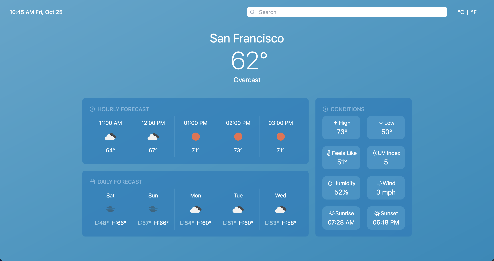
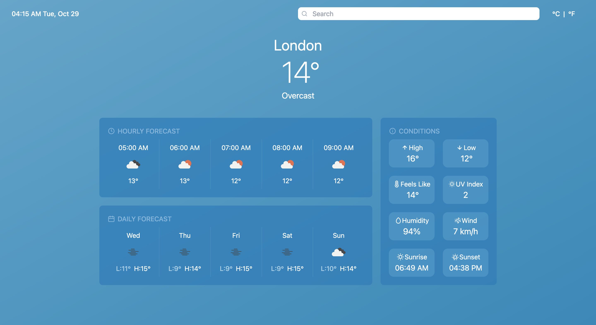

# Weather

This is a weather web application created using React, Tailwind CSS, and the Open-Meteo API. For any searched city, it provides the current temperature, an hourly and daily forecast, and the current weather conditions. The default temperature unit is set to Fahrenheit, but it can be toggled to Celsius. The app is deployed on Github and can be accessed [here](https://pan-cynthia.github.io/weather/). 





## Getting Started

To install and run the app locally, follow these steps in your terminal:

1. Clone the repo:

```bash
git repo clone https://github.com/pan-cynthia/weather.git
```

2. Install the dependencies:

```bash
npm install
```

3. Start the development server:

```bash
npm run dev
```

4. Open app in localhost:

```
--host
```

## 